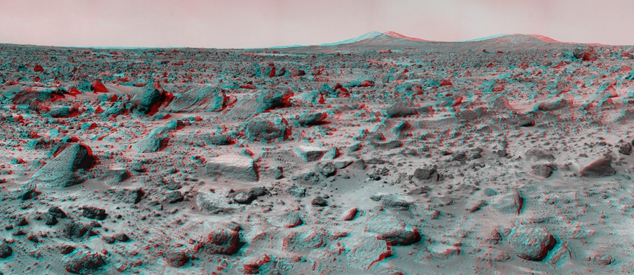
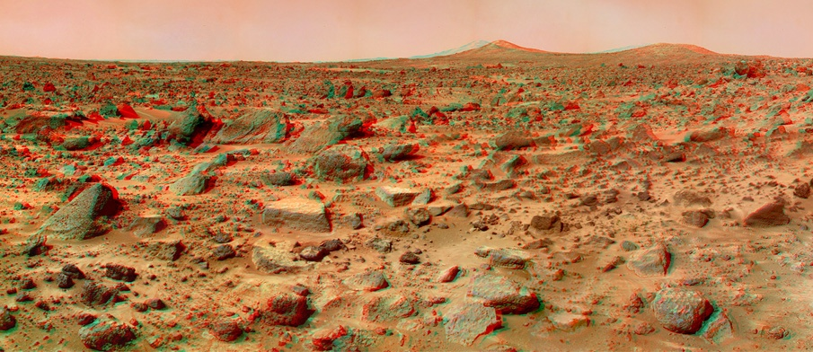
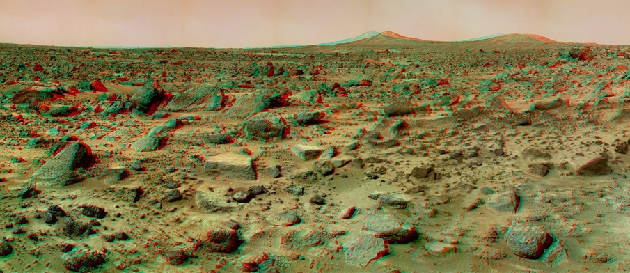
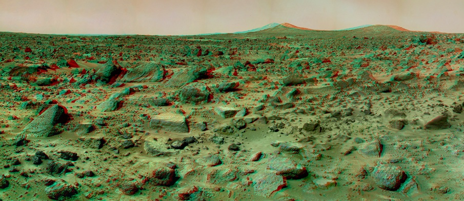
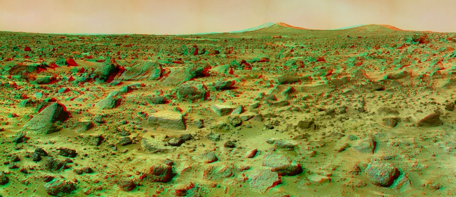
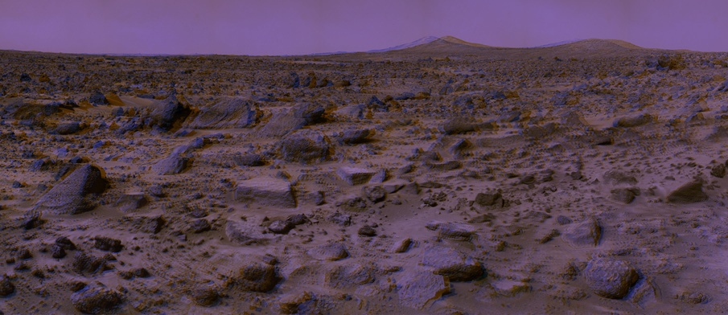

# Analygraph-Ganerator
Analygraph Ganerator using Eigen

# Run

The program can be run in the terminal as such:

Analygraph.exe [type] [mt] [mc] [func] [imgpath1] [imgpath2]

[type] is to be replaced with "single" if the input is a single image or replaced with "pair" if the inputs are two images. 

[mt] is to be  replaced with "Y" if you want to run with multithread. Otherwise, replace it with "N".

[mc] is to be replaced with "Mc" if you want to use Matrix-computing approach. Replace it with "Intuitive" if you want to use "Intuitive approach".

[func] is to be replaced with "True", "Gray", "Color", "HalfColor", "Optimized", "DuBois", "Roscolux" to generate analygraph with corresponding functions

[imgpath1] and [imgpath2] is to be replaced with image file name, [imgpath2] can be empty if [type] is "single".

# Examples
1) True analygraph

2) Gray analygraph

3) Color analygraph

4) Half-Color analygraph

5) 3DTV-optimized analygraph

6) DuBois analygraph

7) Roscolux analygraph

